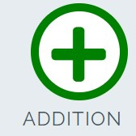

#  Love Maths!  
## Overview
Allows the user to practice their math skill's and to get points for it.  
[link to "Love Maths!" website](https://zolske.github.io/love-maths/)  
## Development  
The site is a walkthrough project of the ["code institute"](https://codeinstitute.net/all-access-coding-challenge/?utm_term=code%20institute&utm_campaign=CI+-+UK+-+Search+-+Brand&utm_source=adwords&utm_medium=ppc&hsa_acc=8983321581&hsa_cam=1578649861&hsa_grp=62188641240&hsa_ad=486298911546&hsa_src=g&hsa_tgt=kwd-319867646331&hsa_kw=code%20institute&hsa_mt=e&hsa_net=adwords&hsa_ver=3&gclid=Cj0KCQiAzMGNBhCyARIsANpUkzOtFLUen6PvLOP2wqDyg5gysGdvxtxxlp9c-E8XAJVuoP9OhVGJauoaAizuEALw_wcB) to practice JavaScript.  
I have slightly changed the layout of the side and changed the implementation of the subtraction and division functions / code.
## Personal note  
#### On line 26 in the index.html,  
`<button data-type="addition" ...> ... </button>`  
`data-type=""` *is a html attribute* its value can be any name by which it can be referenced in CSS. The value is what appears on the website  
  
#### On line 114 in the style.css,  
`.btn--big::after {content: attr(data-type); ... }`  
is attached after the button with the class of "btn--big" and styled with css *(difficult to center / align on page)*.  
*(see [w3schools.com](https://www.w3schools.com/tags/att_data-.asp) for more details)*